# DP2 AnaCal shear catalog — v0

anacal/fpfs shear measurement on the LSST DP2 `deep_coadd` cell coadds, r/i/z,
run through the same xlens pipeline as HSC PDR3. Repo `dp2`, skymap
`lsst_cells_v2`, 820 tracts with `|b_gal| > 15`.

| stage | collection | datasets |
|---|---|---|
| systematics | `u/xiangchl/anacal-v0/systematics` | 81,573 patches (mask, GAIA catalog) |
| measurement | `u/xiangchl/anacal-v0/measure` | 81,249 patch catalogs |
| merge | `u/xiangchl/anacal-v0/merge` | 820 tract catalogs, **146.34 M objects**, 144 columns, 129 GB |
| diagnostics | `u/xiangchl/anacal-v0/diagnostics` | 820 × (meanshear, hist), basic cuts |
| diagnostics2 | `u/xiangchl/anacal-v0/diagnostics2` | 820 × (meanshear, hist), full cuts — the figures below |

Pipelines in `pipelines/`. Band weights are FIXED survey-wide (r 0.2735, i
0.5373, z 0.1892 — the HSC values (need to update)); detection is the r,i,z
coadd with anacal's own per-cell inverse-variance weights.

## Merged catalog columns

One row per primary detection, already filtered by `is_primary` and
`wsel > 1e-5`. `<b>` is `lsst_r`, `lsst_i`, `lsst_z`.

| column | meaning |
|---|---|
| `ra`, `dec` | sky position [deg] |
| `x1`, `x2` / `x1_det`, `x2_det` | patch pixel position, measurement / detection |
| `object_id`, `tract_id`, `patch_x`, `patch_y` | provenance; bootstrap over `tract_id` |
| `fpfs1_e1`, `fpfs1_e2` | band-combined FPFS ellipticity, WCS-corrected |
| `fpfs1_de{1,2}_dg{1,2}` | shear response of the shape |
| `wsel`, `dwsel_dg{1,2}` | selection weight and its shear response |
| `fpfs1_m00`, `fpfs1_m20` (+ `dm*_dg{1,2}`) | band-combined FPFS moments; `trace = (m00+m20)/m00` |
| `esq`, `desq_dg{1,2}` | `e1²+e2²` and its response — for an \|e\| cut in one read |
| `n_mask_base` | Gaussian-weighted masked fraction [0,1] |
| `bkg`, `dbkg_dg{1,2}` | local background |
| `<b>_flux_fpfs1`, `<b>_flux_fpfs1_err`, `<b>_s2n_fpfs1` | per-band FPFS flux and S/N (+ `d*_dg{1,2}`) |
| `<b>_mag_fpfs1`, `<b>_mag_fpfs1_err` | ditto as magnitudes |
| `<b>_flux_gauss2`, `<b>_mag_gauss2` (+ `_err`, `d*_dg{1,2}`) | fixed-aperture Gaussian photometry — use these for magnitudes and colours |
| `<b>_ext_shapeHSM_HsmPsfMoments_{xx,yy,xy,flag}` | PSF second moments at the source |
| `<b>_ext_shapeHSM_HigherOrderMomentsPSF_{03..40}` | PSF moments up to 4th order |

Per-band shapes, the raw detection-band `fpfs_*` columns and the
per-band `fpfs1_m00`/`m20` are dropped by the merge — they exist only in
the per-patch `measure` catalogs.

## Per-object shear

```python
e1 = wsel * fpfs1_e1
e2 = wsel * fpfs1_e2
r1 = wsel * fpfs1_de1_dg1 + dwsel_dg1 * fpfs1_e1
r2 = wsel * fpfs1_de2_dg2 + dwsel_dg2 * fpfs1_e2
response = 0.5 * (r1 + r2)
```

The shear of a bin is a **ratio of sums**, per-object shear is defined as
```python
g1 = e1 / (response + response_sel).mean()
g2 = e2 / (response + response_sel).mean()
```

`response` carries the shape response and the `wsel` part of the
selection response. **`response_sel` — the response of the cuts below —
is NOT included.** Those cuts are shear-dependent (an \|e\| or S/N cut
selects on the quantity being measured) and their response depends on
how the sample is binned, so it has to be built once the binning is
fixed; `desq_dg{1,2}` is there to build the ±γ variant of the \|e\| cut.
Without it the shear is biased at the level of the selection response,
typically a few percent.

Errors: bootstrap over **tracts** (`tract_id`), not objects —
neighbouring objects share a PSF model, a mask and a background.

Whole sample under the selection below: **20.02 M objects**,
⟨γ₁⟩ = −0.0000004, ⟨γ₂⟩ = +0.00012, mean response 0.347.

## Selection (diagnostics2)

| group | cut | keeps alone |
|---|---|---|
| basic | `lsst_i_mag_gauss2` < 24 | 79.27% |
| basic | `lsst_i_s2n_fpfs1` > 10 | 47.69% |
| basic | \|e\| < 0.4 | 76.32% |
| basic | `n_mask_base` < 0.035 | 83.86% |
| basic | trace > 0.15 | 72.98% |
| colour | \|r−i\| < 1.3 / \|i−z\| < 1.3 | 92.62% / 96.91% |
| PSF ellipticity | \|e1\| < 0.10 / \|e2\| < 0.10, in **all** of r,i,z | 99.18% / 98.34% |
| flux error | `flux_gauss2_err` < 200 (r) / < 400 (i) / < 600 (z) nJy | 94.57% / 89.84% / 90.27% |
| | **all combined** | **20.63%** (30.19 M of 146.34 M) |

The PSF-ellipticity and flux-error cuts are *survey-properties* selections, so
they choose where on the sky the sample comes from.

## Diagnostics

Raw per-tract sums stacked over 820 tracts, bootstrapped over tracts;
p-values are per component against zero and treat bins as independent.
Grey histogram = the sample fraction in each bin.

### Mean shear vs PSF

PSF ellipticity is the additive-bias test — leakage would show as a
slope. γ₁ is flat (p = 0.12–0.89) and γ₂ is unremarkable in five of six
panels after these cuts; PSF e2 (i) remains at p = 0.05.

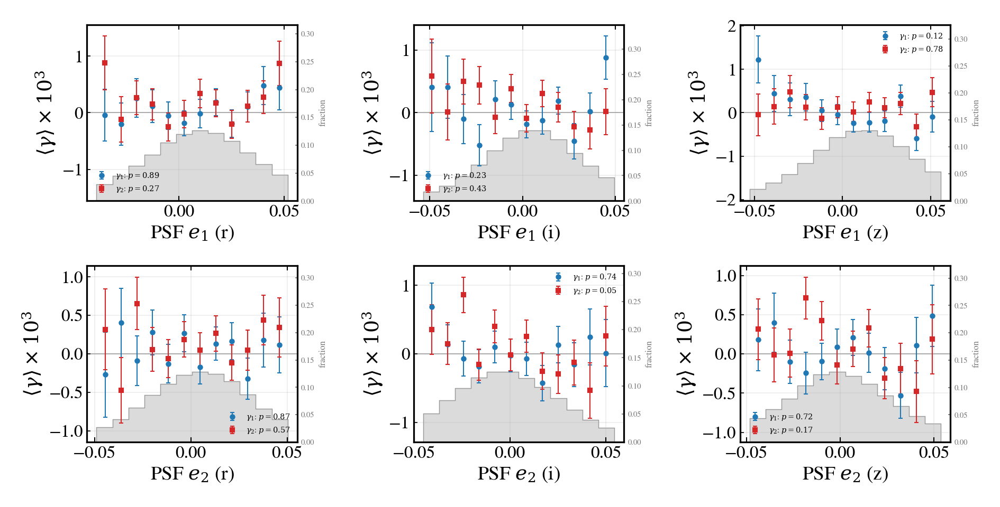
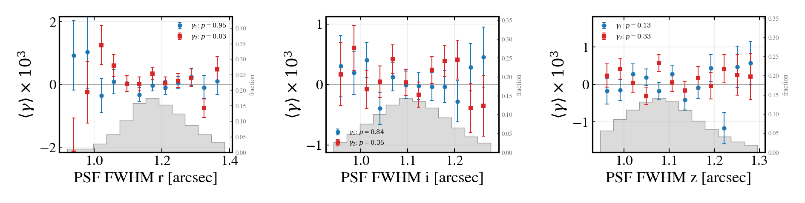

### Mean shear vs photometry

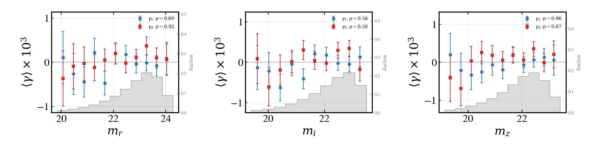
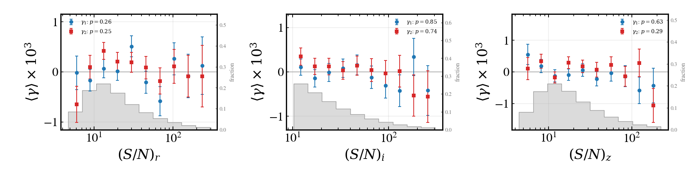
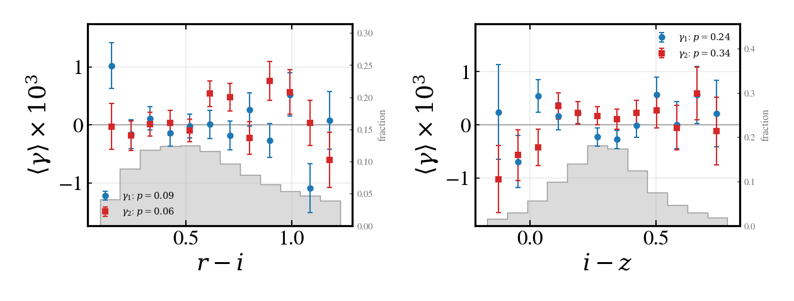

### Mean shear vs depth and survey properties

`flux_gauss2_err` is a depth/seeing label rather than a galaxy property
— DP2 carries no `nImage`, so it is the only depth axis available. (TODO: need updates)

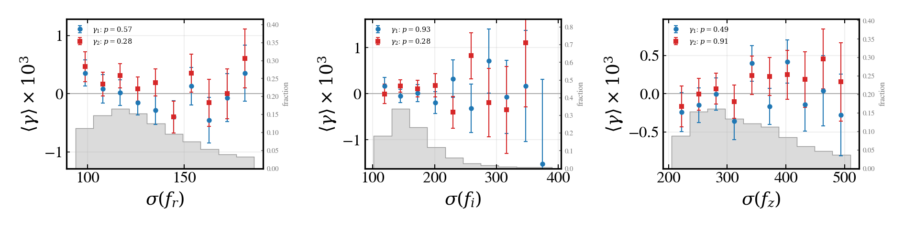
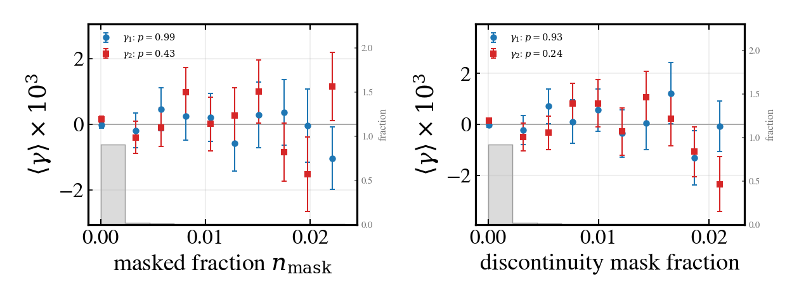
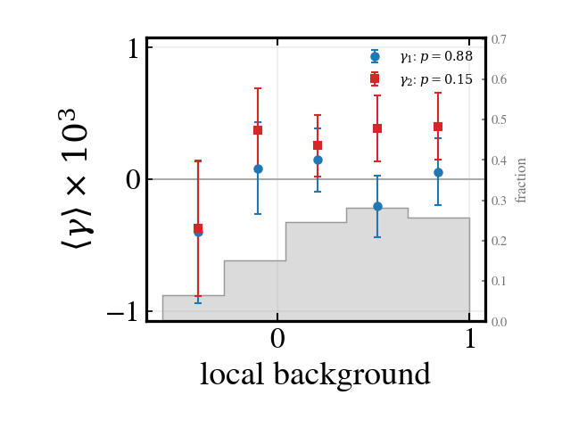

### Mean shear vs shape

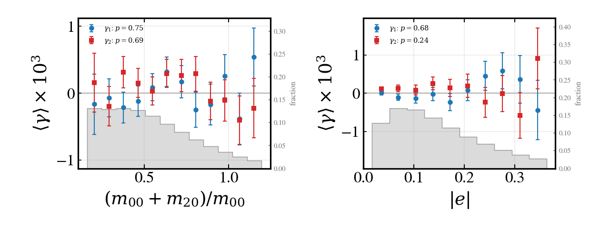

### Distributions

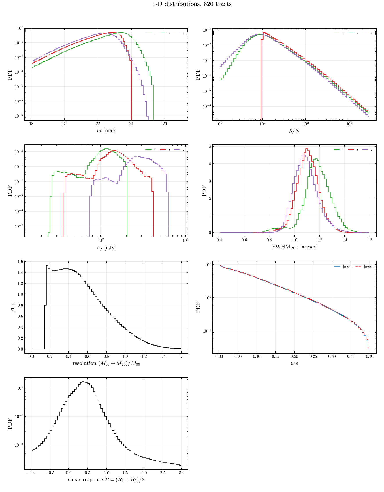
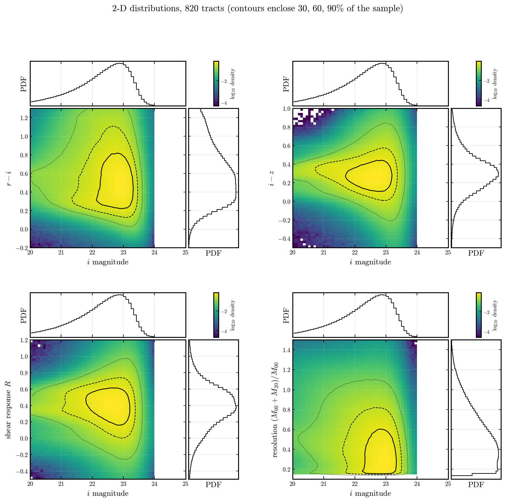


### Clusters

Randomly selected massive low-z cluster to confirm we can get positive
tangential shear

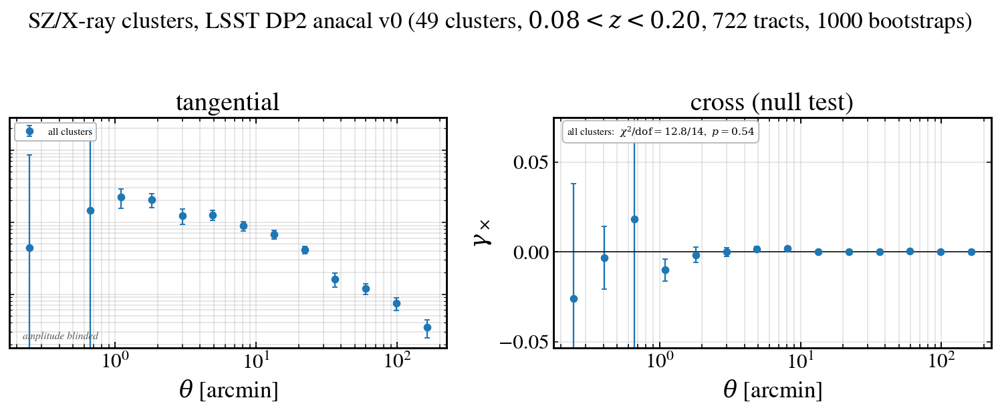

