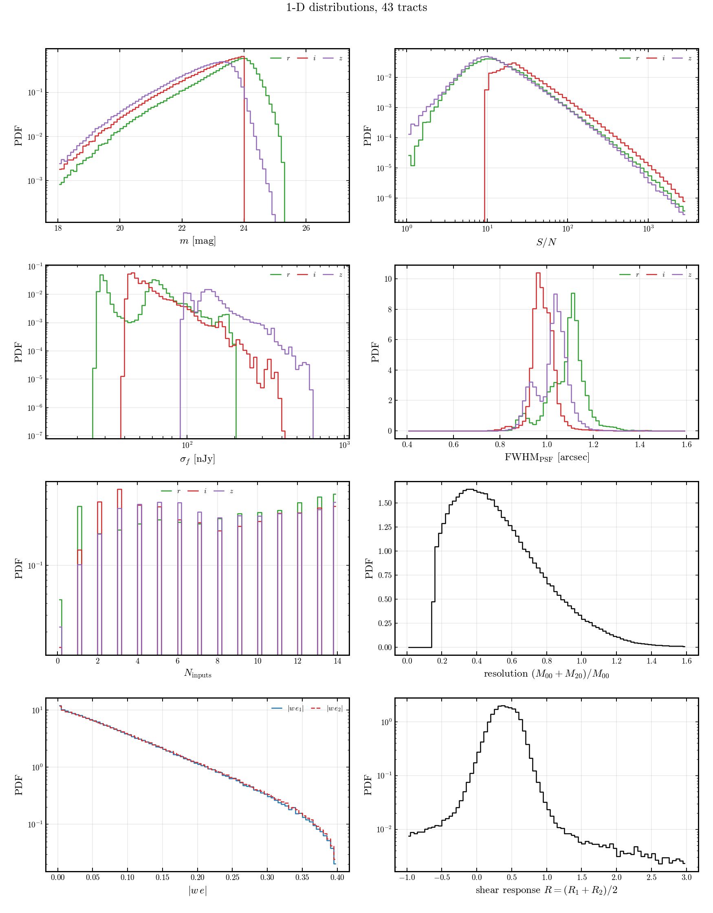
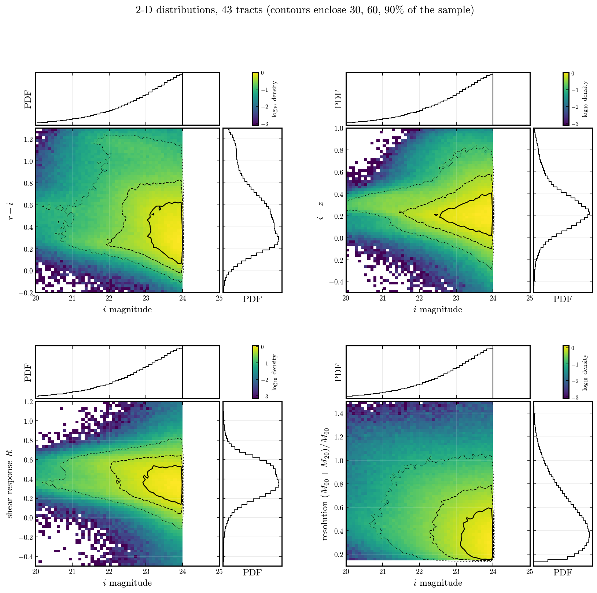

# Histograms — DP2 v0

[← back to README](README.md) · [null tests](null_tests.md) · [image simulation](sim.md)

Distributions of the catalog quantities under the
[diagnostics2 selection](README.md#selection-diagnostics2), stacked over
tracts. Sim-vs-obs versions of these live in [sim.md](sim.md).

## Wide field (820 tracts)

## Deep fields (EDFS, ECDFS, COSMOS — 43 tracts)

Same quantities on the 43 deep-field tracts, with bin ranges re-measured for
the ~1 mag deeper sample.

