# Null tests — DP2 v0

[← back to README](README.md) · [histograms](histograms.md) · [image simulation](sim.md)

Mean shear against PSF, photometry, survey properties and shape, under the
[diagnostics2 selection](README.md#selection-diagnostics2). Raw per-tract sums
stacked over the tracts and bootstrapped over tracts (neighbouring objects
share a PSF model, a mask and a background); p-values are per component
against zero and treat bins as independent. The grey histogram in each panel
is the sample fraction per bin.

## Wide field (820 tracts)

Whole sample under the selection: **20.02 M objects**, ⟨γ₁⟩ = −0.0000004,
⟨γ₂⟩ = +0.00012, mean response 0.347.

### Mean shear vs PSF

PSF ellipticity is the additive-bias test — leakage would show as a slope.
γ₁ is flat (p = 0.12–0.89) and γ₂ is unremarkable in five of six panels after
these cuts; PSF e2 (i) remains at p = 0.05.

### Mean shear vs photometry

### Mean shear vs depth and survey properties

`flux_gauss2_err` is a depth/seeing label rather than a galaxy property — DP2
carries no `nImage`, so it is the only depth axis available. (TODO: need updates)

### Mean shear vs shape

### Clusters (positive control)

Randomly selected massive low-z cluster to confirm we can get positive
tangential shear.

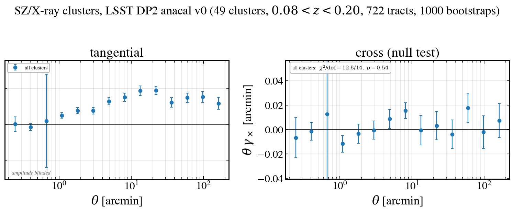

## Deep fields (EDFS, ECDFS, COSMOS — 43 tracts)

The same `diagnostics2` selection on the 43 deep-field tracts
(`merge_withz_deep_fields`), with bin ranges re-measured for the ~1 mag deeper
sample. Whole deep sample under the selection: **606,443 objects**,
⟨γ₁⟩ = −0.00059, ⟨γ₂⟩ = −0.00019, mean response 0.379.

### Mean shear vs PSF

Across the six PSF-ellipticity panels γ₁ gives p = 0.05–0.61 and γ₂
p = 0.36–0.93; the tightest are PSF e2 (r) and PSF e1 (i) in γ₁
(p = 0.05–0.06), consistent with noise over the smaller deep footprint.

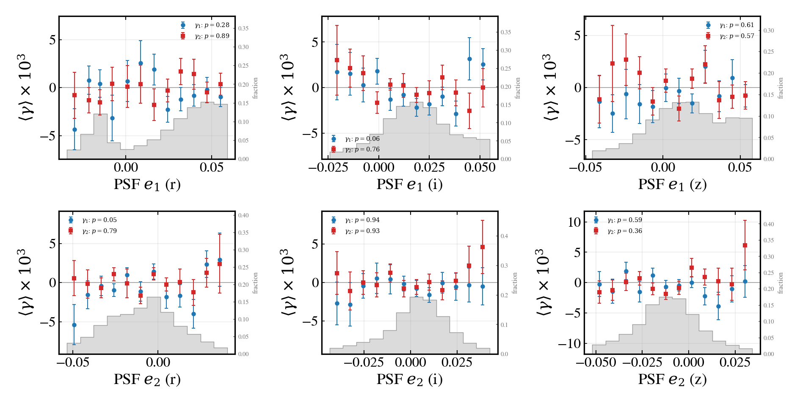
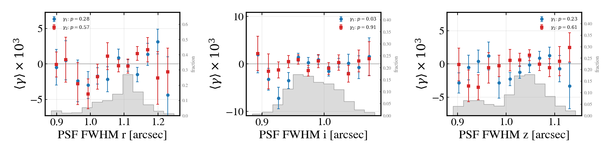

### Mean shear vs photometry

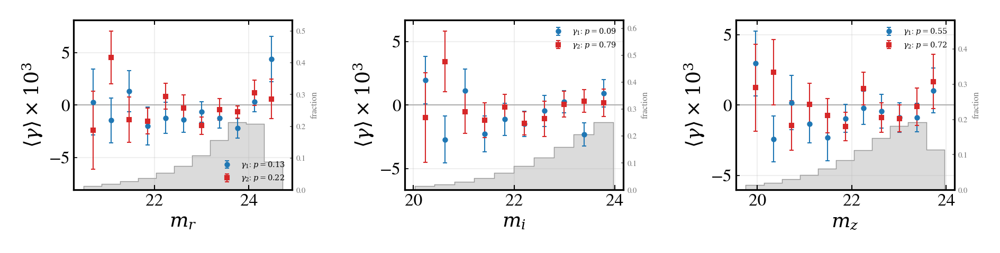
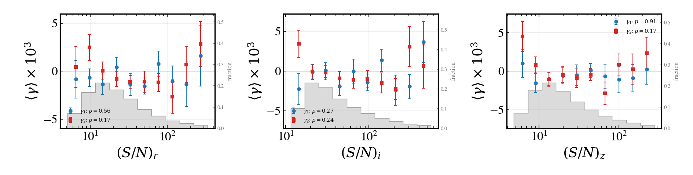
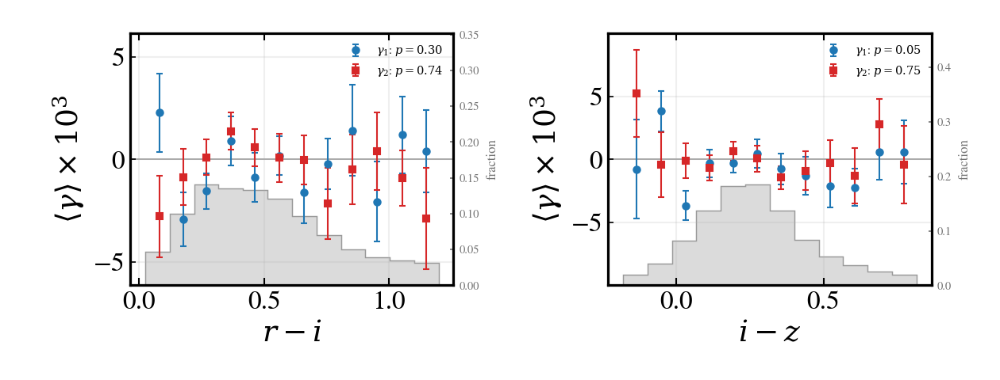

### Mean shear vs depth and survey properties

The deep fields carry a per-band `n_inputs` (visit count), so a coverage panel
is available here that the wide field lacks.

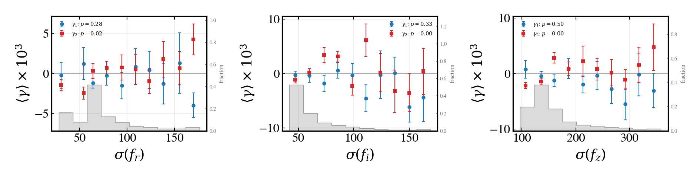
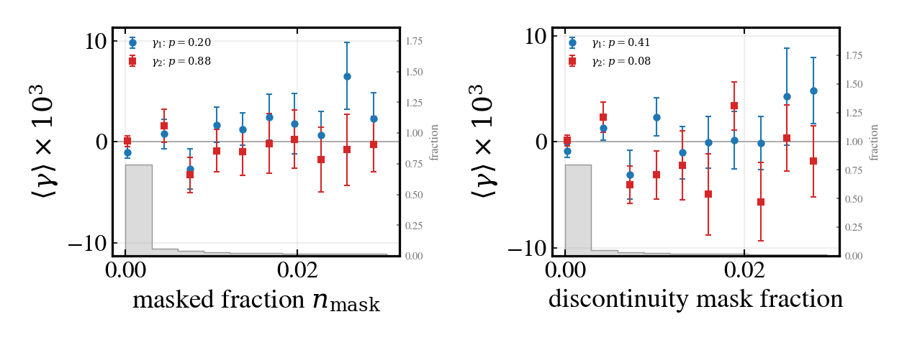
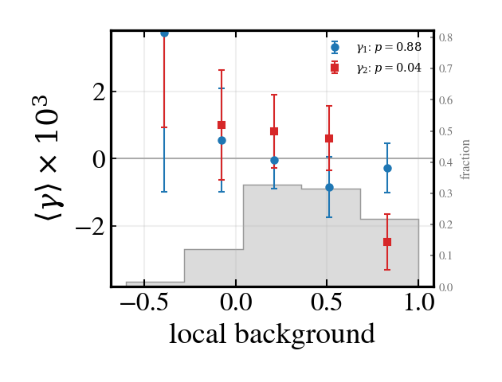
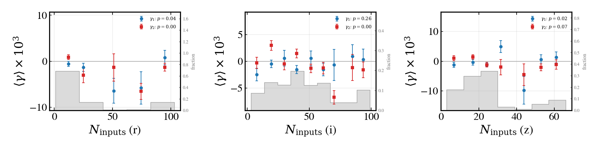

### Mean shear vs shape and position

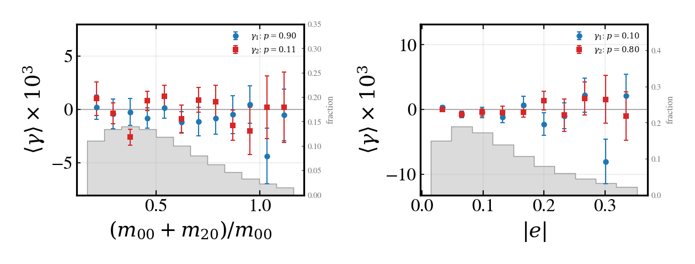
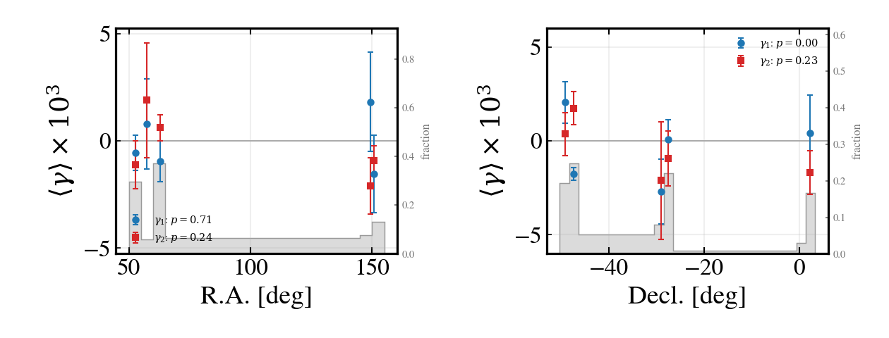
