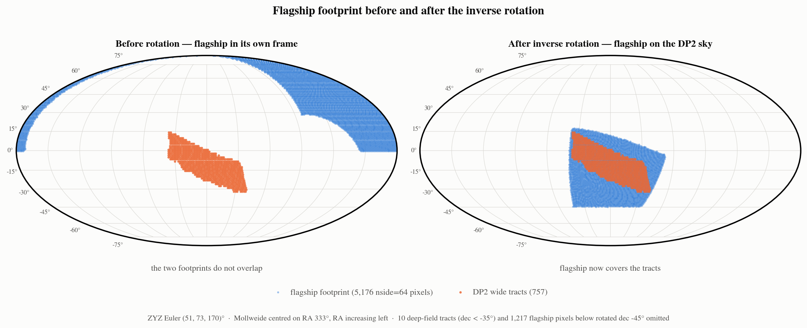
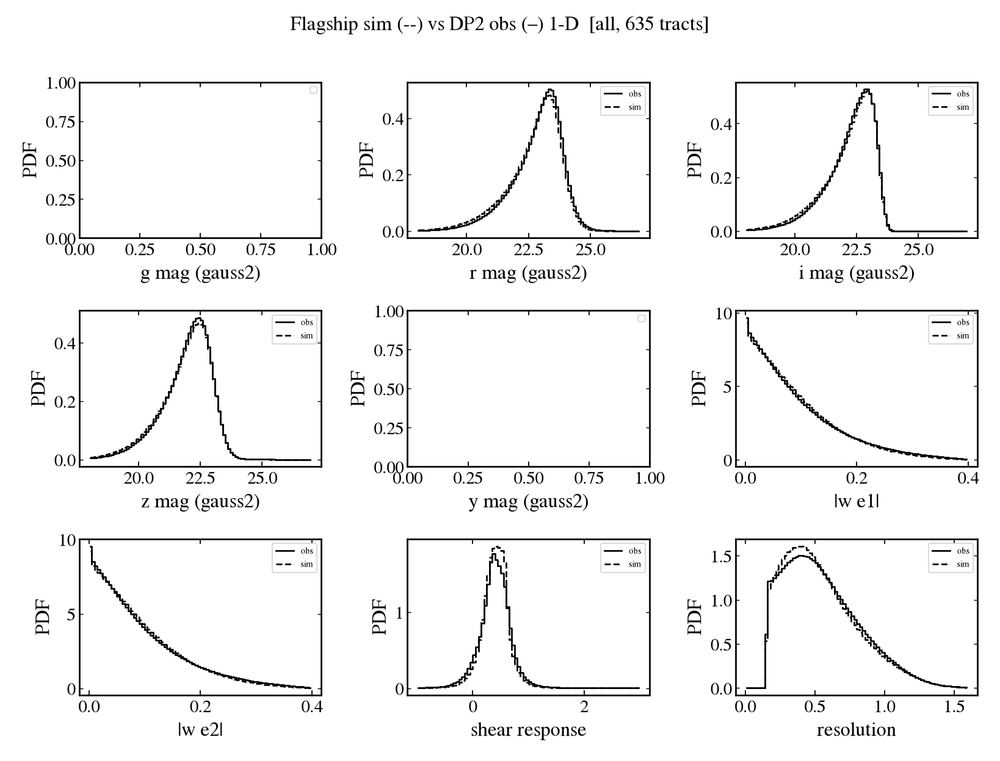
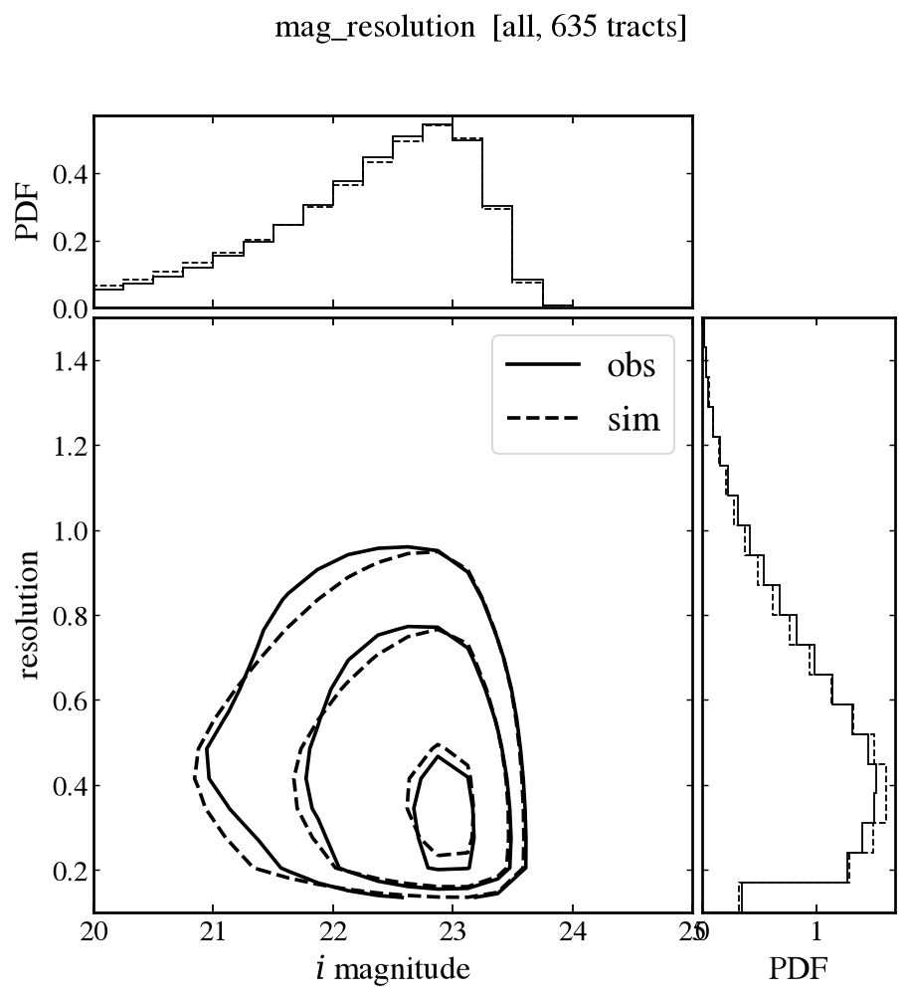
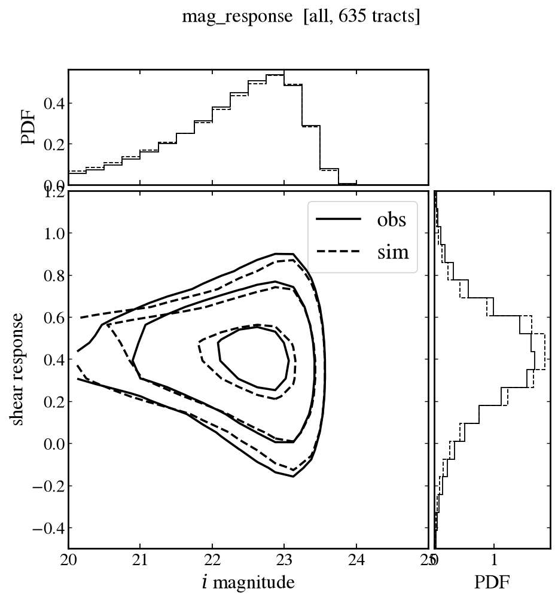
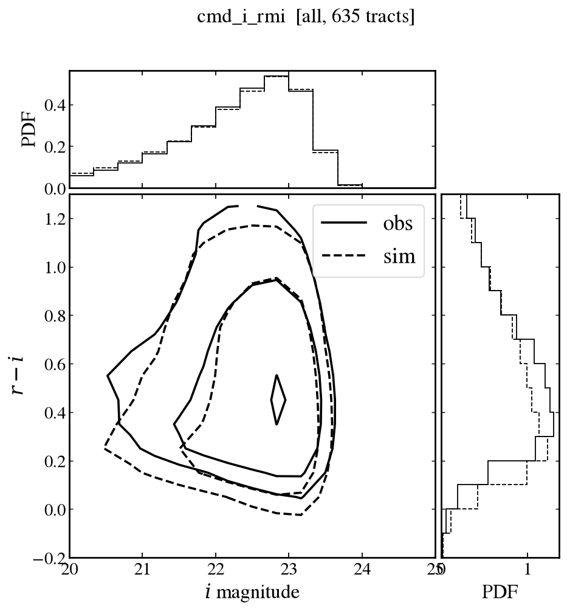
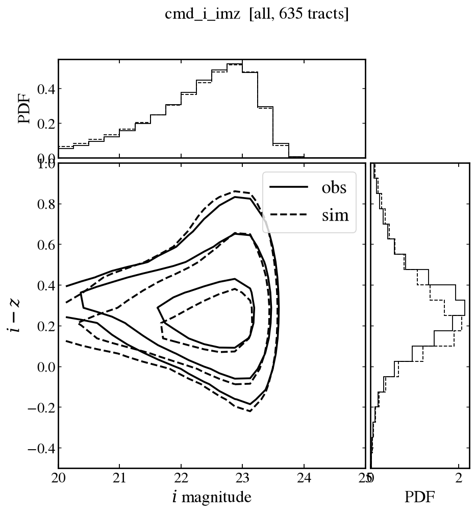

# Image simulation (Flagship) — DP2 v0

[← back to README](README.md) · [histograms](histograms.md) · [null tests](null_tests.md)

Flagship galaxies drawn into the measured DP2 PSF, noise correlation and mask
over the same 757 wide tracts, then measured with the identical pipeline, so
the simulated merged catalog `sim_flagship_anacal_merged` has the same 144
columns as the observed one. This is the end-to-end check that the shear
catalog's shapes, magnitudes and response match the data.

| stage | collection | datasets |
|---|---|---|
| sim | `u/xiangchl/anacal-v0/sim_flagship` | 73,454 patch catalogs over 757 tracts (359 lost to zero noise-correlation) |
| sim merge | `u/xiangchl/anacal-v0/sim_flagship_merged` | 757 tract catalogs, **129.87 M objects**, 144 columns, 99 GB — same schema as `merge` |
| sim vs obs | `u/xiangchl/anacal-v0/sim_obs_compare` | 635 tracts (sim ∩ obs) × binned sim/obs histograms |

Inputs: truth from `flagship_truthCatalog_patch` (per patch = the patch outer
bbox grown by 30″, so a quantum loads ~36 k rows instead of the 2.7 M-row
tract catalog); PSF, noise correlation and mask from
`u/xiangchl/anacal-v1/systematics`. The 359 missing patches are ones whose
noise-correlation array is identically zero in that systematics product.

**Cost.** ~175 node-hours for the wide sim (30 nodes × 5 h, plus a 50 min
relaunch for the last 8 k patches), then ~0.7 node-hours to merge and ~20 min
on one node to compare.

## Footprint rotation

The Flagship footprint lies elsewhere on the sky, so it is rotated onto the
DP2 field with an inverse ZYZ Euler rotation (51, 73, 170)° before the truth
catalog is cut into tracts and patches.

## Sim vs obs

635 tracts common to sim and obs; obs solid, sim dashed, with marginal
densities on the top and right axes (the DESCNote `corner_plot` style).

| quantity | sim | obs |
|---|---|---|
| resolution `trace` | 0.482 | 0.499 |
| shear response | 0.386 | 0.380 |
| i / r / z mag (gauss2) | 22.35 / 22.89 / 22.02 | 22.38 / 22.98 / 22.05 |
| \|e₁\| / \|e₂\| (= w ε) | 0.067 / 0.068 | 0.067 / 0.068 |
| detections | 28.2 M | 27.0 M |

